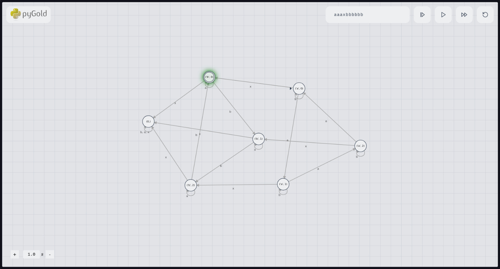

.. These are examples of badges you might want to add to your README:
   please update the URLs accordingly

    .. image:: https://api.cirrus-ci.com/github/<USER>/mercury.svg?branch=main
        :alt: Built Status
        :target: https://cirrus-ci.com/github/<USER>/mercury
    .. image:: https://readthedocs.org/projects/mercury/badge/?version=latest
        :alt: ReadTheDocs
        :target: https://mercury.readthedocs.io/en/stable/
    .. image:: https://img.shields.io/coveralls/github/<USER>/mercury/main.svg
        :alt: Coveralls
        :target: https://coveralls.io/r/<USER>/mercury
    .. image:: https://img.shields.io/pypi/v/mercury.svg
        :alt: PyPI-Server
        :target: https://pypi.org/project/mercury/
    .. image:: https://img.shields.io/conda/vn/conda-forge/mercury.svg
        :alt: Conda-Forge
        :target: https://anaconda.org/conda-forge/mercury
    .. image:: https://pepy.tech/badge/mercury/month
        :alt: Monthly Downloads
        :target: https://pepy.tech/project/mercury
    .. image:: https://img.shields.io/twitter/url/http/shields.io.svg?style=social&label=Twitter
        :alt: Twitter
        :target: https://twitter.com/mercury

.. image:: https://img.shields.io/badge/-PyScaffold-005CA0?logo=pyscaffold
    :alt: Project generated with PyScaffold
    :target: https://pyscaffold.org/

|

=======
Mercury
=======

An automata tool based around delta functions for ease of use

Installation:
------

.. code-block:: bash

   # For basic package usage
   pip install mercury-lib

   # For graphical interface support
   pip install mercury-lib[web]

   # For full functionality support (requires graphviz installed)
   pip install mercury-lib[all]

Usage:
------

.. code-block:: python

    from mercury.automata import DeterministicFiniteAutomata
    from mercury.decorators import DeltaFunction
    from mercury.operations.sets import S

    states = S({"a", "b"}) * S(range(3)) | S({0})
    input_symbols = "abx"
    initial_state = ("a", 0)
    final_states = [("b", 0)]

    delta = DeltaFunction()

    @delta.definition()
    def _(_: int, next: str):
        return 0

    @delta.definition()
    def _(w: str, y: int, next: str):
        if w == "a" and next == "a":
            return (w, (y + 1) % 3)
        elif w == "a" and next == "b":
            return (w, y)
        elif w == "a" and next == "x":
            return ("b", (3 - y) % 3)
        elif w == "b" and next == "b":
            return (w, (y + 1) % 3)
        elif w == "b" and next == "a":
            return (w, y)
        else:
            return 0

    automata = DeterministicFiniteAutomata(
        states, input_symbols, initial_state, final_states, delta
    )

    print(automata.accepts_input("x"))
    print(automata.accepts_input("aaaxbbb"))
    print(automata.accepts_input("aaax"))
    print(not automata.accepts_input("axbb"))

More information can be found at the documentation hosted at Github Pages

.. _pyscaffold-notes:

Note
====

This project has been set up using PyScaffold 4.6. For details and usage
information on PyScaffold see https://pyscaffold.org/.
